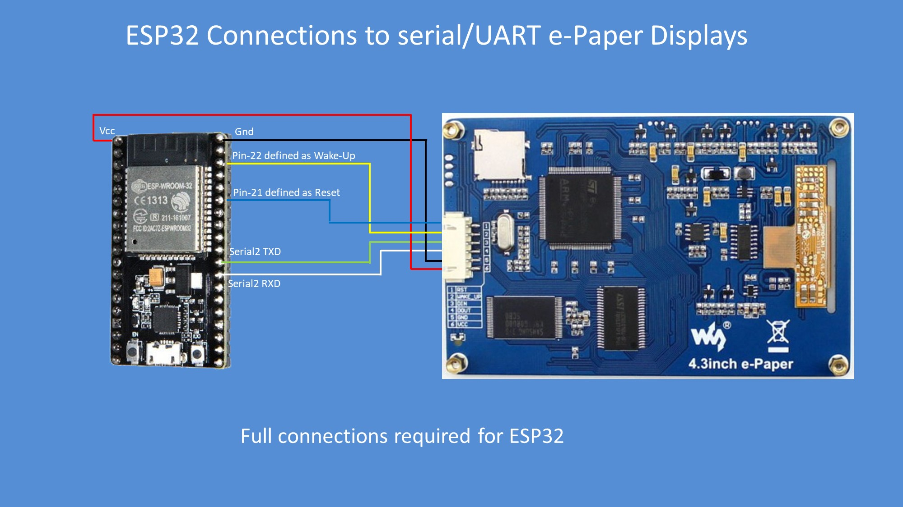

ESP32 EPD E-Paper Library
=======

ESP32 Arduino Library for the 4.3inch e-Paper display by Waveshare

This repository combines the esp32 epd-library by [G6EJD](https://github.com/G6EJD/ESP32-8266-ePaper-Serial-UART-Wx-Display) based on the library published by [sabas1080](https://github.com/sabas1080/LibraryEPD) with the example made by sabas1080.

See wiring.jpg and wiring-usb.jpg for information on how to connect the Display

Instead of using RX0/TX0 this library and example use RX2/TX2 to communicate with the display.

## Issues with English/ASCII-Text

If your display only shows chinese text, when it should be showing english text, try to update the firmware. You'll find the current firmware files in the [Waveshare Wiki](https://www.waveshare.com/wiki/4.3inch_e-Paper_UART_Module).
